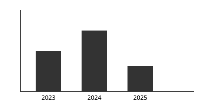

# Resultados y discusión

## Presentación de resultados

Los datos relevados muestran una tendencia sostenida a lo largo del período analizado, tal
como se observa en la @fig-tendencia.

{#fig-tendencia}

## Análisis e interpretación

Los resultados obtenidos permiten identificar una asociación entre las dimensiones
institucional y subjetiva definidas en el capítulo de Metodología, en línea con lo planteado
por Castel [-@castel1997]:

> La cuestión social [...] es una aporía fundamental gracias a la cual una sociedad
> experimenta el enigma de su propia cohesión y trata de conjurar el riesgo de su
> fractura. [@castel1997, p. 20]

## Discusión

### Comparación con la literatura seleccionada

Los hallazgos son consistentes con los antecedentes revisados, aunque introducen matices
respecto de la dimensión temporal del fenómeno.

### Implicaciones de los resultados

Estos resultados tienen implicancias tanto teóricas como prácticas para el campo disciplinar,
que se retoman en el capítulo de Conclusiones.
